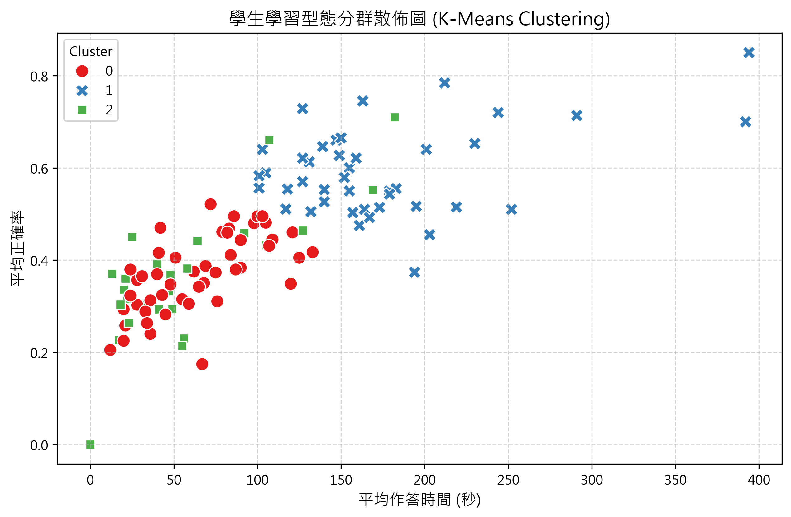

# 第 6 週：K-Means 分群實作與學習型態分析

## 1. 分析目標
利用第 5 週抽取之學習特徵（平均正確率、平均作答時間、完成率、完成任務數），透過 K-Means 非監督式學習演算法，將學生劃分為不同的學習型態群體，作為後續落後風險預警之基礎。

## 2. 執行流程與方法
* **資料標準化**：使用 `StandardScaler` 進行 Z-score 標準化，消除各特徵量綱差異。
* **分群演算法**：採用 K-Means 演算法（$K=3$）。
* **產出檔案**：
  * 分群結果數據庫：`data/clustered_students.csv`
  * 學習型態散佈圖：`figures/kmeans_clusters_scatterplot.png`

## 3. 視覺化結果
以下為學生學習型態分群之散佈圖（以平均作答時間與平均正確率為主要觀測軸）：

## 4. 階段性成果
已順利建立 K-Means 聚類模型，並產出對應之學生分群標籤，下階段將進行各群體特徵統計與預警機制閾值設定。
